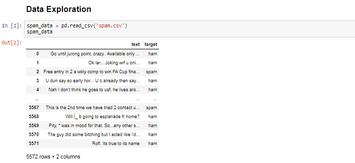

# Spam Detection in Text Messages using Natural Language Processing
###from sklearn.feature_extraction.text import CountVectorizer
###from sklearn.model_selection import train_test_split
###from sklearn.feature_extraction.text import TfidfVectorizer
###from sklearn.naive_bayes import MultinomialNB
###from sklearn.metrics import roc_auc_score
###from sklearn.svm import SVC
###from sklearn.linear_model import LogisticRegression

